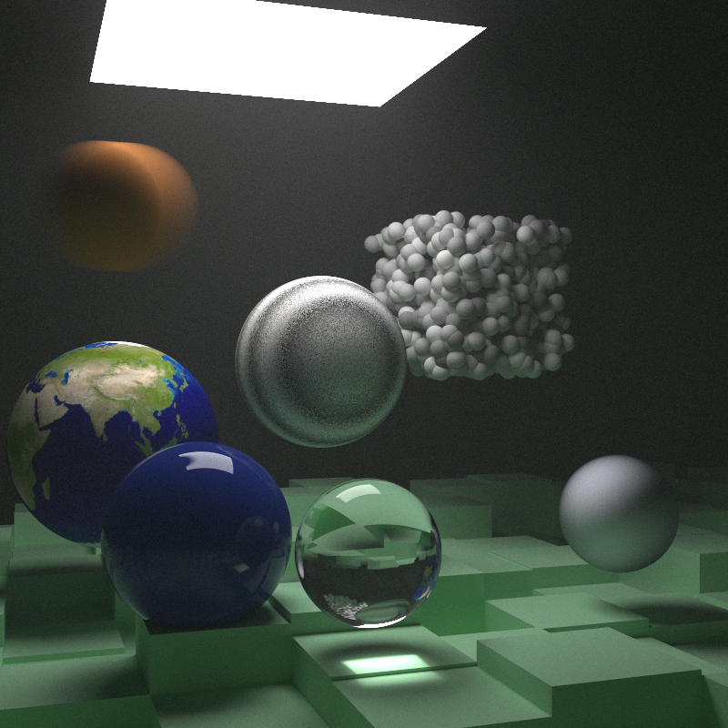

# ray_tracing

A ray tracer written in Rust, built by following the *Ray Tracing in One Weekend* book series.



## Why

Mostly as a hobby. I wanted to make something different on the side. Something with numbers and math in it, something that makes me think hard and tires my brain a bit.

I also wanted to take a look at Rust and learn the basics. Doing both in one project felt like a good deal.

A ray tracer turned out to be a good fit. Every bug shows up as a picture. If something is wrong, the image tells you, usually in a strange way. And the books give you a clear path. You read a chapter, you write the code, you get an image, and you compare it with the one in the book. If they match, you move on.

## How

The books are written in C++. I followed them chapter by chapter and rewrote everything in Rust as I went.

That was the interesting part. Some things from the C++ version don't fit Rust well, so I changed them:

- The C++ code passes a hit record in by reference and fills it. In Rust I return `Option<HitRecord>` instead.
- The books use shared pointers and virtual classes for objects, materials and textures. I used plain enums. It runs faster, and I find it easier to follow.
- The hit record borrows the material instead of copying it. This was my first real use of lifetimes.
- I used `rayon` to render on all cores, and the `image` crate to load textures.

I don't understand all the math yet. Some formulas I typed in and checked the output against the book. When the image matched, I moved on. When it didn't, I had to go back and actually understand what the code was doing. That's where most of the learning happened.

## Things that went wrong

A few bugs I remember:

- My Perlin noise looked like marble veins instead of the book's pattern. All the random vectors were pointing in the same direction.
- The Cornell box came out too dark. One shape was returning a zero normal, so half the rays went straight through the walls.
- After adding rotation, the boxes disappeared but their shadows were still there. One wrong sign.
- The whole renderer froze once. A debug print inside the parallel loop was waiting for a lock that the main thread was holding.

I kept notes after every session in [LOG.md](LOG.md). The details are there.

## Performance

The final scene of the second book is 800x800 pixels with 10,000 samples per pixel. My first full render took about 38 minutes. The latest one took about **27**.

Don't take these numbers too seriously. I ran them on my laptop with a lot going on in the background: too many browser tabs, a YouTube video playing, Docker running. And the conditions were never the same between two runs. Treat them as a rough idea, not a benchmark.

Getting there was slower than I expected. I guessed a lot, and most guesses did not work. Then I started using a profiler (`samply`) and looked at where the time actually goes. That taught me more than any single fix.

## Running it

```bash
cargo build --release
./target/release/ray_tracing > image.ppm
```

The output is a PPM file. Most image viewers can open it. Preview works on macOS.

To pick a scene, change the number in the `match` inside `main()` in `main.rs`. The earth scene needs `earthmap.jpg` in the folder you run it from.

## Progress

The default branch has the latest book I finished. Earlier books stay in their own branches, so you can see what the code looked like at the end of each one.

- [x] Ray Tracing in One Weekend (branch `in-one-weekend`)
- [x] Ray Tracing: The Next Week (default branch)
- [ ] Ray Tracing: The Rest of Your Life

## Credits

Everything here is based on the [Ray Tracing in One Weekend](https://raytracing.github.io/) series by Peter Shirley, Trevor David Black and Steve Hollasch. The books are free to read online. If you want to learn this, start there, not here.